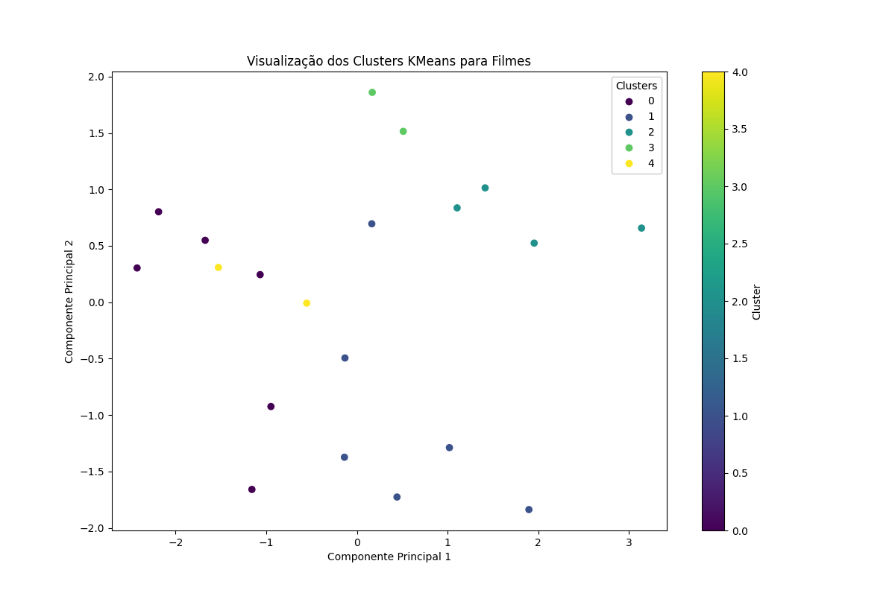

# movie-recommendation-api
Essa é uma api de recomendação de filmes baseado no modelo KMEANS. Nesse relatório irei dar uma breve descrição de como o modelo funciona e como esta aplicado aos dados utilizados.

# Estrutura do Projeto

O projeto está estruturado da seguinte forma:

- **/src**: Contém os arquivos principais da API.
  - **controller**: Controladores para lidar com as requisições HTTP.
  - **db**: Definição do modelo do Banco de dados.
  - **service**: Lógica de negócio para manipulação do sistema de recomendação.
  - **routes**: Definição das rotas da API usando FastAPI.

- **app.py**: Ponto de entrada da aplicação.
- **mock_data.json**: Banco de dados mockado utilizado para treinamento do modelo.
- **train_model.py**: Serviço separado de treinamento do modelo Kmeans executado ao rodar o docker.

# Compilação e Execução

### Pré-requisitos
- Docker
- Liberar porta **8000** na sua máquina local

### Passos para Execução e Utilização das Rotas

1.  **Construir o container**
    ```bash
    docker build -t recomendation-api .

2.  **Rodar o container**
    ```bash
    docker run -it -p 8000:8000  recomendation-api


## Rotas

- **Obter todos os filmes**
  - **Método**: GET
  - **URL**: http://localhost:8000/filmes

- **Obter recomendações por usuário**
  - **Método**: GET
  - **URL**: http://localhost:8000/filmes/{user_id}/recomendacoes
substitua {user_id} pelo usuário desejado.

vale lembrar que a api trata usuários que não existem. Você receberá uma mensagem de erro caso tente recomendação para usuário inexistente. 

# Banco de dados 

Foi utilizado 3 tabelas no modelo SQL para realizar essa aplicação: Usuários, Filmes e Avaliações. 
A tabela avaliações contem chaves estrangeiras para se referenciar a filmes e usuários.

Os exemplos foram gerados utilizando um modelo IA generativo seguindo as seguintes regras:
Usuário contem nome e email; Filmes contém titulo, diretor, genero e atores; Avaliações contém usuário_id, filme_id e avaliação. 

**Observação:** Para esse tipo de aplicação eu usaria, em *produção*, possívelmente, um banco de dados não relacional como MongoDB poís trataria-se de dados semi-estruturados em uma abordagem mais simples e correta. Outra opcão seria PostgreSQL, o que possibilitaria consultas eficientes. No entanto, a fim de cumprir os propósitos desse case de forma "as simple as possible" optei por usar SQLite por ser leve, facil de configurar e sem necessidade de servidor.

# Modelo Kmeans

O treinamento do modelo ocorre logo que a aplicação é inicializada utilizando Docker. Em produção, eu proporia que esse modelo fosse executado periodicamente. De forma alguma ele deve ser executado junto com a API, pois isso adicionaria latência à aplicação. Dessa forma, os serviços devem ser desacoplados.

Eu utilizei alguns dados mockados para execução desse trabalho. Eu defini que o número de clusters do modelo é igual a 5 a fim de tentar definir cada cluster a um usuário (isso não necessariamente deve acontecer). Depois eu treinei o modelo tentando separar cada filme em um cluster diferente. Para fazer isso foi utilizado uma técnica de redução de dimensionalidade chamada PCA como na imagem abaixo. (não se apegue aos valores das linhas e colunas do PCA, eles são não representativos).



## Resultado dados Mockados 


Para cada usuário foi definido que a api retornaria os 5 primeiros filmes recomendados e para cada usuário os resultados foram os seguintes:

- **Usuário 1:** Anchorman(comédia), Forrest Gump(drama), The Big Lebowski(comédia), Guardians of the Galaxy(ação), The Grand Budapest Hotel(comédia)

- **Usuário 2:** Pride and Prejudice(romance), La La Land(romance), Superbad(comédia), The Hangover(comédia), The Godfather(drama)

- **Usuário 3:** Inception(sci-fi), The Matrix(sci-fi), Die Hard(ação), The Shawshank Redemption(drama), Joker(drama)

- **Usuário 4:** Blade Runner(sci-fi), Mad Max(ação), Anchorman(comédia), Forrest Gump(drama), The Grand Budapest Hotel(comédia)

- **Usuário 5:** The Matrix(sci-fi), The Notebook(romance), Superbad(comédia), The Shawshank Redemption(drama), The Social Network(drama)


É possível notar um padrão claro e a preferência de cada usuário (esse comportamento foi reforçado no momento de gerar dados aleatórios com o modelo generativo). O primeiro usuário tem uma preferência por filmes de comédia assim como o segundo prefere romances.

Em uma possível continuidade desse trabalho eu reproduziria mais dados para treinar o modelo e aumentaria o número de clusters para ter melhor visualização do comportamento do KMeans. No entanto, mesmo com poucos dados, foi possível ter um resultado positivo.